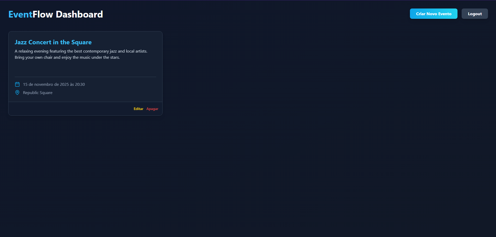

# EventFlow: A Full Stack Event Management Platform

[](https://opensource.org/licenses/MIT)
[](https://github.com)

## 🚀 About The Project

**EventFlow** is a comprehensive full-stack web platform designed to showcase a modern, robust, and scalable software architecture. It serves as a signature project that demonstrates proficiency in backend design, reactive frontend development, and containerized infrastructure orchestration. The platform allows organizers to create and manage events, and for standard users to view them.

## ✨ Key Features

* **Secure JWT Authentication:** Complete registration and login flow with expiring JSON Web Tokens.
* **Role-Based Access Control (RBAC):**
    * **User (`USER`):** Standard role, can view events.
    * **Organizer (`ORGANIZER`):** Privileged role, can create, edit, and delete events.
* **Event Management (CRUD):** Full Create, Read, Update, and Delete operations for events.
* **Protected Endpoints:** Event management routes are protected by guards that verify both authentication (JWT) and authorization (`ORGANIZER` role).
* **Reactive Frontend:** A dynamic user interface built with **React** and **TypeScript**, which adapts based on the logged-in user's role.
* **Containerized Environment:** The entire stack (Backend, Frontend, Database) is orchestrated with **Docker Compose**, ensuring a consistent and easy-to-set-up development environment with a single command.

## 📸 Visual Showcase

**1. Authentication Pages**
*A responsive, two-column layout presents the brand and provides clear forms for new user registration and existing user login.*

*Login Screen:*


*Register Screen:*


**2. Standard User Dashboard**
*A standard `USER` sees the list of events but does not have access to administrative controls, ensuring data security.*


**3. Organizer Dashboard**
*An `ORGANIZER` has full access, with buttons to create, edit, and delete events, demonstrating role-based access control (RBAC).*


**4. Create Event Modal**
*An elegant modal allows organizers to add new events without leaving the main page, improving the user experience.*


## 🏗️ Tech Stack & Architecture

This project is built as a **Monorepo**, containing the backend and frontend applications in a single repository for streamlined management.

| Area | Technology | Purpose |
| :--- | :--- | :--- |
| **Backend** | **NestJS (Node.js/TS)** | Modular API, Dependency Injection, JWT & RBAC Auth |
| **Frontend** | **React (TypeScript/Vite)** | Reactive UI, state management, and API communication |
| **Database** | **MySQL 8.0** | Relational data persistence |
| **Infrastructure**| **Docker / Docker Compose** | Containerization and orchestration of all services |

### Architecture Diagram


## 🚦 Getting Started: Running Locally

This project is designed to run with a single command, thanks to Docker.

### Prerequisites

* [Docker Desktop](https://www.docker.com/products/docker-desktop/) installed and running.
* [Git](https://git-scm.com/)

### Installation & Launch

1.  **Clone the repository:**
    ```bash
    git clone [https://github.com/](https://github.com/)[YOUR_USERNAME]/eventflow-platform.git
    cd eventflow-platform
    ```

2.  **Create your environment file:**
    Duplicate the `.env.example` file and rename it to `.env`. Fill in the necessary variables (like `DB_ROOT_PASS` and `JWT_SECRET`).

3.  **Build and run with Docker Compose:**
    This single command will build the images, start the containers, and connect the entire stack.
    ```bash
    docker-compose up --build
    ```

4.  **Access the application:**
    * **Frontend (React):** `http://localhost:5173`
    * **Backend (NestJS API):** `http://localhost:3000`

## 📚 API Documentation

For a detailed description of the endpoints, request/response models, and testing, please refer to a Postman / Thunder Client collection or the Swagger documentation generated by NestJS (if implemented).

* **Register Endpoint:** `POST /auth/register`
* **Login Endpoint:** `POST /auth/login`
* **Profile Endpoint:** `GET /auth/profile` (JWT Protected)
* **Events Endpoints:** `GET`, `POST`, `PATCH`, `DELETE` at `/events` (Write routes protected by `ORGANIZER` role).

## 📄 License

This project is licensed under the MIT License. See the [LICENSE](LICENSE) file for details.
```eof